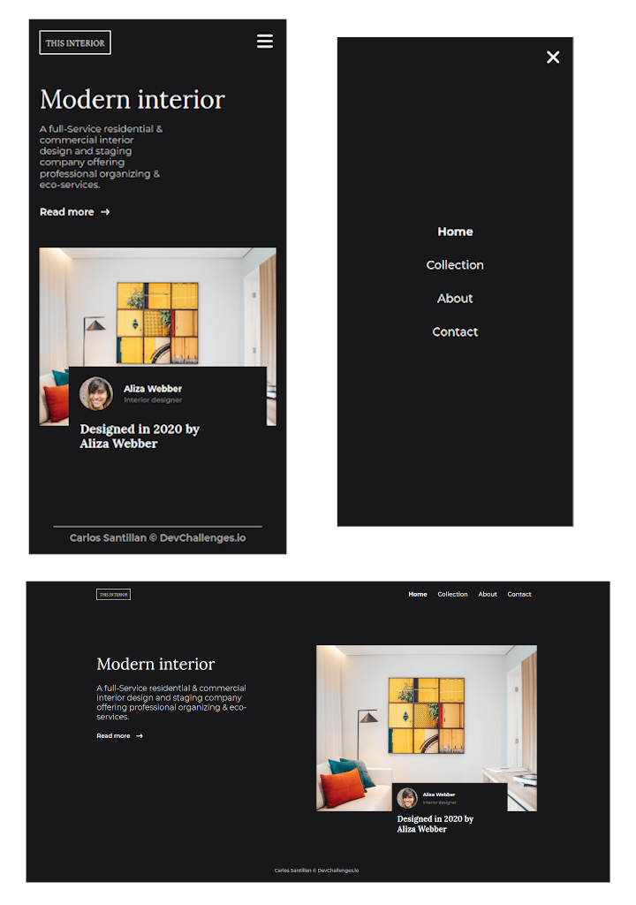

<!-- Please update value in the {}  -->

<h1 align="center">Interior Consultant</h1>

   Solution for a challenge from  <a href="http://devchallenges.io" target="_blank">Devchallenges.io</a>.

  <h3>
    <a href="https://carlossantesp.github.io/interior-consultant">
      Demo
    </a>
     | 
    <a href="https://github.com/carlossantesp/interior-consultant">
      Solution
    </a>
     | 
    <a href="https://devchallenges.io/challenges/Jymh2b2FyebRTUljkNcb">
      Challenge
    </a>
  </h3>

<!-- TABLE OF CONTENTS -->

## Table of Contents

- [Overview](#overview)
  - [Built With](#built-with)
- [Features](#features)
- [Acknowledgements](#acknowledgements)
- [Install](#install)
- [Contact](#contact)

<!-- OVERVIEW -->

## Overview

> If you want to see the demo visit the following link [Demo](https://carlossantesp.github.io/interior-consultant)

This challenge for me was something interesting to solve, since it allowed me to first analyze how to make the template before coding

### Built With

- [Sass](https://sass-lang.com/documentation)
- [Normalize.css](https://necolas.github.io/normalize.css/)
- [BEM](http://http://getbem.com/)

## Features

This application/site was created as a submission to a [DevChallenges](https://devchallenges.io/challenges) challenge. The [challenge](https://devchallenges.io/challenges/Jymh2b2FyebRTUljkNcb) was to build an application to complete the given user stories.

## Acknowledgements
- [Steps to replicate a design with only HTML and CSS](https://devchallenges-blogs.web.app/how-to-replicate-design/)
- [Node.js](https://nodejs.org/)
- [Marked - a markdown parser](https://github.com/chjj/marked)

## Install
For this project you need the following plugins in VScode:
- Live Server
- Live Sass compiler

## Contact

- GitHub [@carlossantesp](https://github.com/carlossantesp)
- Linkedin [@dev-santillan-carlos](https://www.linkedin.com/in/dev-santillan-carlos)
